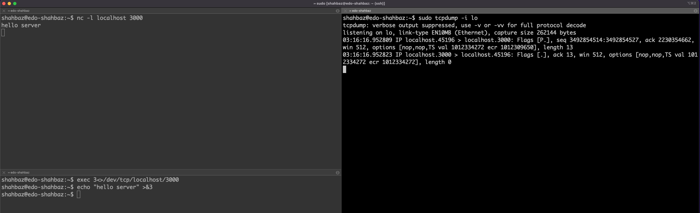

# Demo: Client-Server Communication in a Shell

In this demonstration, we will learn how to start a simple server application in a Bash shell and then have a client connect to it. We will test both TCP and UDP protocols and analyze their traffic pattern using Linux's [`tcpdump`](https://en.wikipedia.org/wiki/Tcpdump) utility.

## Pre-Requisites and Dependencies

For this demonstration, we assume the following development environment and tools.

- Linux OS, more specifically Ubuntu 16.04 or higher, running either as a Docker, VM, or a baremetal machine.
  > **NOTE:** read more [here](../../assignments/assignment0#part-a-install-docker) on how to install Docker on your machine/laptop.
- The following utilities, which typically come pre-installed in most OS images.
  - `nc`: netcat for creating [arbitrary TCP and UDP connections](https://www.tutorialspoint.com/unix_commands/nc.htm)
  - `tcpdump`: a tool for capturing ["network packets on an interface"](https://en.wikipedia.org/wiki/Tcpdump)

## Client-Server Communication using TCP

For TCP demonstration, we will open three terminals for the server, client, and tcpdump.

**a. On the server terminal,** run the following command:
```
$ nc -l localhost 3000
```

This will start a local TCP server using the `localhost` IP address (127.0.0.1), ready to listen/accept connections on port `3000`.

> **NOTE:** you can find the localhost IP address under the `/etc/hosts` file. For example ...
> ```
> $ cat /etc/hosts
> 127.0.0.1 localhost
> 127.0.1.1 edo-shahbaz
> ```

**b. On the client terminal,** we will intiate a TCP connection using the Linux's TCP pseudo-device format, `/dev/tcp/$host/$port`. Run:
```
$ exec 3<>/dev/tcp/localhost/3000
```

This will intiate a TCP connection from the client to server and return the socket file descriptor in `3`. We will now use this descriptor to send/receive packets.

To send packets from the client to server, run:
```
$ echo "hello server" >&3
```

The above command redirects the output of `echo` ("hello world") to the file descriptor `3`, causing TCP to forward it to the server.

**c. On the tcpdump terminal,** run the following command:
```
$ sudo tcpdump -i lo
```

This will instruct `tcpdump` to start capturing any packets on the Linux `lo` (loopback) interface; the interface with the `127.0.0.1` IP address.

> **NOTE:** You can double-check the IP address for the `lo` interface using the following command:
> ```
> $ ifconfig lo
> lo: flags=73<UP,LOOPBACK,RUNNING>  mtu 65536
>        inet 127.0.0.1  netmask 255.0.0.0
> ```

Now, repeat step (b). You should see a similar output on the `tcpdump` terminal:
```
$ sudo tcpdump -i lo
tcpdump: verbose output suppressed, use -v or -vv for full protocol decode
listening on lo, link-type EN10MB (Ethernet), capture size 262144 bytes
03:16:16.952809 IP localhost.45196 > localhost.3000: Flags [P.], seq 3492854514:3492854527, ack 2230354662, win 512, options [nop,nop,TS val 1012334272 ecr 1012309650], length 13
03:16:16.952823 IP localhost.3000 > localhost.45196: Flags [.], ack 13, win 512, options [nop,nop,TS val 1012334272 ecr 1012334272], length 0
```
> **NOTE:** To view packet payload information (e.g., "hello server"), run `tcpdump` with the `-X` flag.
> ```
> $ sudo tcpdump -i lo -X
> ```

**d. To close the socket file descriptor,** run the following command:
```
$ exec 3>&-
```

This will terminate the TCP connection between the client and `nc` server.

## Client-Server Communication using UDP

For UDP, we (mostly) repeat the same steps as above (for TCP) with the following changes:

- In step (a), run `nc` with `-u` flag to instruct it to start a UDP server session. 
  ```
  $ nc -u -l localhost 3000
  ```

- In step (b), replace `tcp` in `/dev/tcp/$host/$port` with `udp`.
  ```
  $ exec 3<>/dev/udp/localhost/3000
  ```  

That's it. Enjoy!

> **Thought Exercise:** Can you identify the difference in the `tcpdump` output for UDP. What is different in this case? (Guess: it's something to do with reliability.)

---
### Example Shell Setup for Testing a TCP Session:


